[](https://classroom.github.com/a/xgzEiJt8)

<style>
.custom-image {
  width: 200px;
  height: auto;
}
</style>

# IT5007 - Assignment3

* **Developer:** Hu Haojie
* **Email:** e0305385@u.nus.edu
* **Student ID:** A0181682Y

This assignment follows most of the instructions provided by the textbook and lecture.

## 1. Instructions to Execute the Project

Please follow the below steps to initialize the project:

* **npm install** to install required dependencies and packages.
* **systemctl start mongod** to start the mongoDB
* **npm run compile** for compilation.
* **npm start** to activate the application
* **localhost:3000** to open the application on the browser.

## 2. Feature implementation

### 2.1 USV CRUD

#### User Sign Up
Here the sign up is somewhat similar to login. Only after user sign up, he / she is able to modify user profile, deregister account or execute operations related to questions.

```Name``` & ```Email``` are mandatory fields for users to sign up.

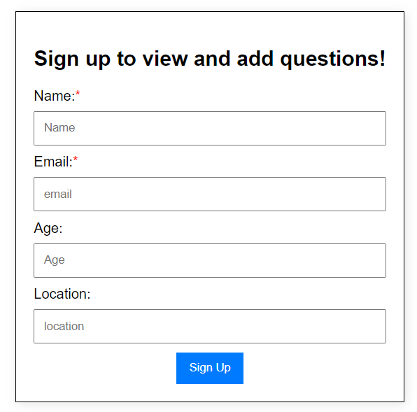

#### User Info Display
Present the basic information of the signup user.

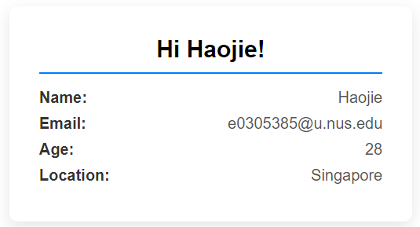

#### Update Profile & User Account Deregister

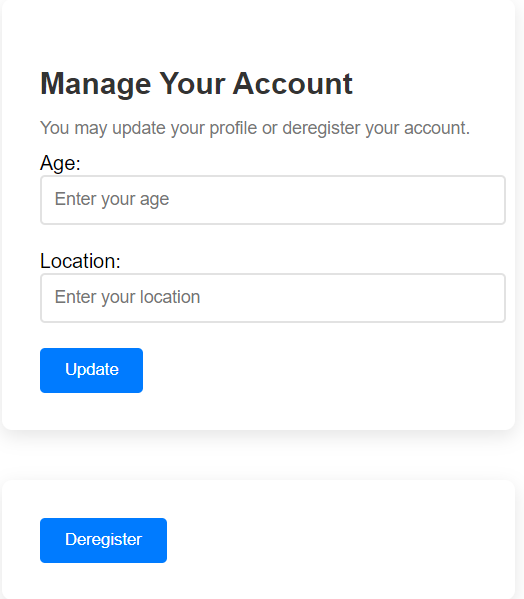

### 2.2 QSV CRUD

#### Display All Questions
Any users can view all questions stored in the DB.

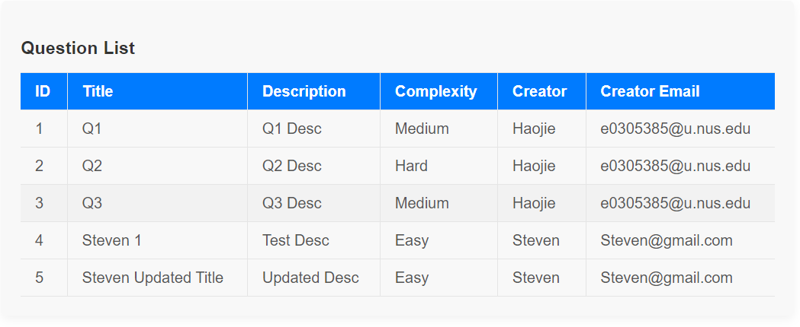

#### Add a New Question
```Question Title``` is mandatory field for users to add a new question.

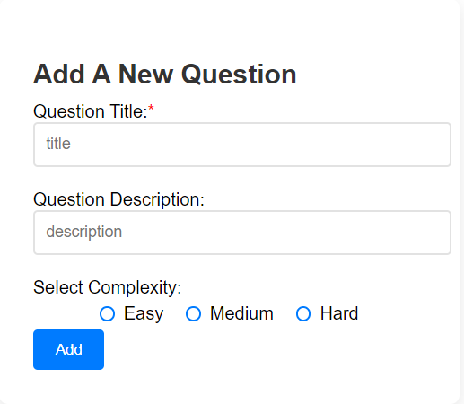

#### Update a Question
```Question ID``` & ```Question Title``` are mandatory fields for users to update question.

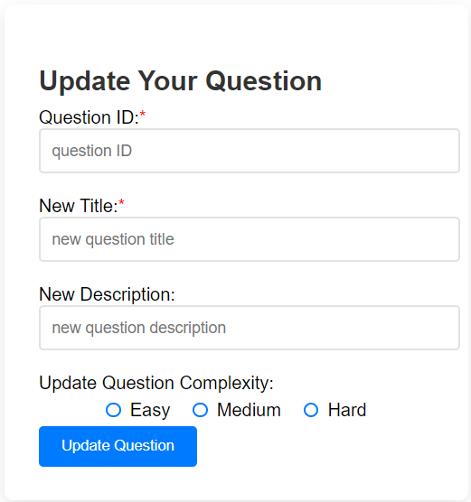

#### Delete a Question
```Question ID``` is mandatory field for users to delete a question.

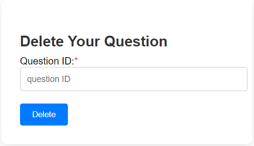

### 2.3 Error Handling

#### Mandatory Input

There are some mandatory inputs requried in the CRUD operations. The validation is built at the client side. If users do not fill in these required fields, the CRUD operation request will not be sent to the backend. 

* **User Sign UP:** Name & Email
* **Add a New Question:** Question TiTle
* **Update a Question:** Question ID & Title
* **Delete a Question:** Question ID

<p float="middle">
  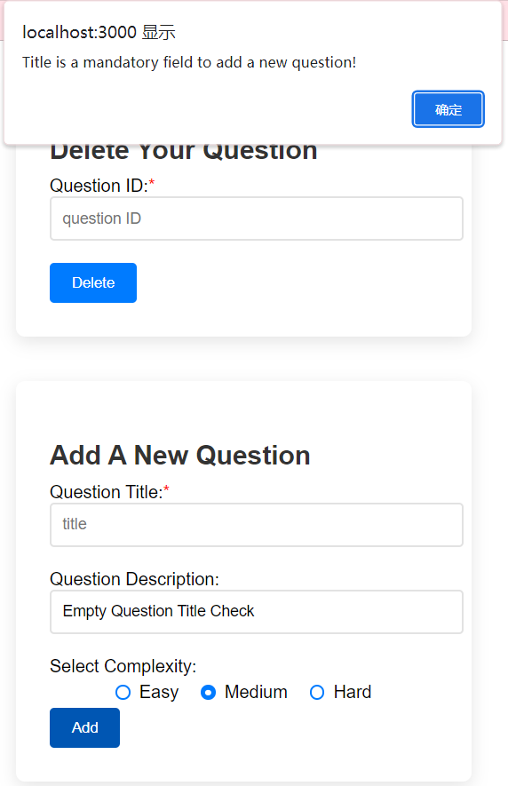
  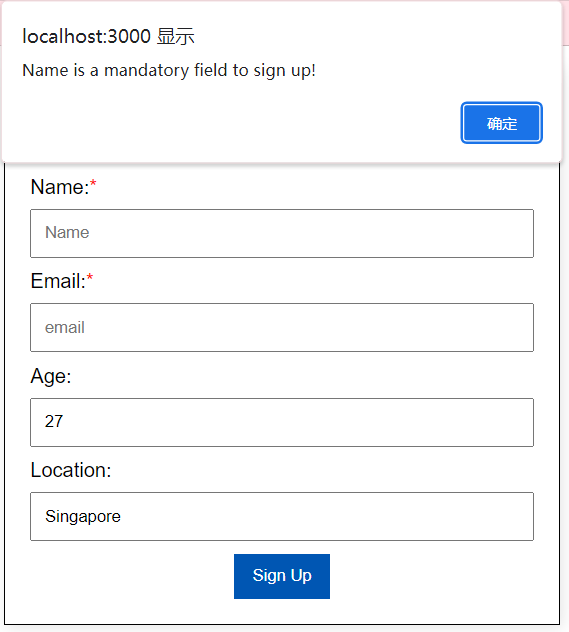 
</p>
  
 #### Execution Error

 There are some error handling including permission check and CRUD server error built at the server side.

* **User Sign UP:** Each user must have a unique email.
* **Add a New Question:** Each question must have a unique and non-empty title.
* **Update a Question:**

  * User is only allowed to update the question created by him / her.
  * User must update an existing question with a valid question ID.
  * The updated title must not be the same as the other question titles.
  
    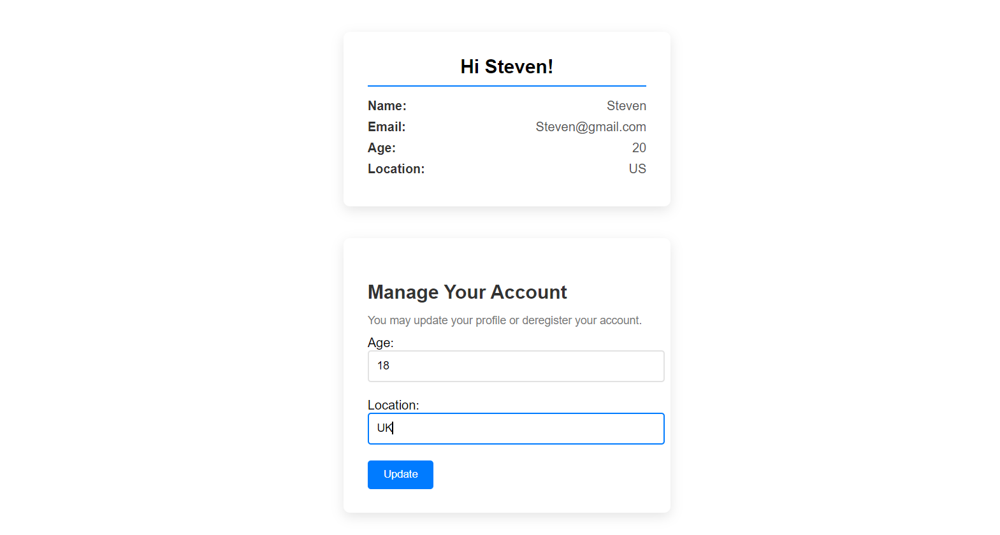

* **Delete a Question:**
  
  * User is only allowed to delete the question created by him / her.
  * User must delete an existing question with a valid question ID.

    <p float="middle">
    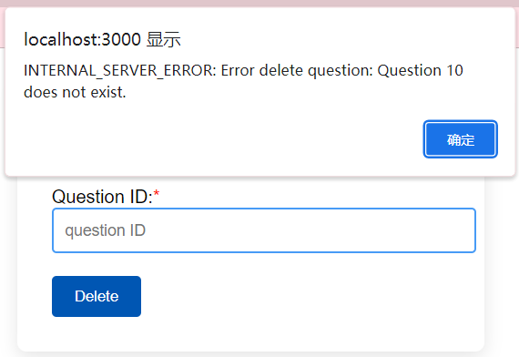
    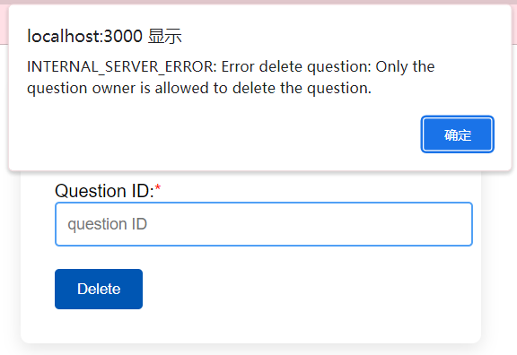 
    </p>

## 3 Styling
Some simple styling development for the website as presented in the above screenshots.